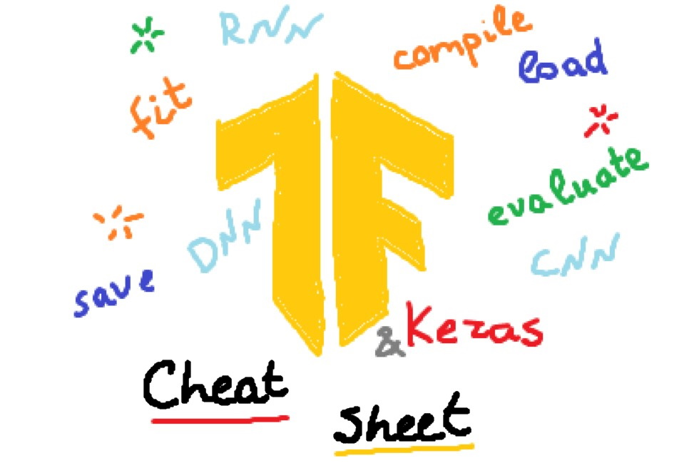

# TensorFlow/Keras cheat sheet

This repository provides cheat sheets for building neural networks using TensorFlow/Keras.

## Medium article

See the article on [Towards Data Science](https://towardsdatascience.com/tensorflow-keras-cheat-sheet-5ec99d9a1ccf).

## Contents

The cheat sheet provides the data about following topics:
- Typical Neural Network Architectures with Sequential API;
- More Complex Neural Network Architectures with Functional API;
- Compile the model;
- Train the model;
- Explore learning curves;
- Evaluate the model;
- Save and load the model.

And also about:
- Using ImageDataGenerator;
- Tokenizing and padding sentences for NLP tasks.

## Repository Content

- `tf_cheat_sheet.ipynb` contains a cheat sheet in a Jupyter notebook
- `tf_cheat_sheet.py` contains cheat sheet in a Python script
- `special_variable_example.ipynb` file contains an example of using a special `_` variable in Jupyter Notebook / Google Colab notebooks